---
## Front matter
title: "Отчёт по лабораторной работе №3"
subtitle: "Дисциплина: Архитектура компьютеров"
author: "Карпова Анастасия Александровна"

## Generic otions
lang: ru-RU
toc-title: "Содержание"

## Bibliography
bibliography: bib/cite.bib
csl: pandoc/csl/gost-r-7-0-5-2008-numeric.csl

## Pdf output format
toc: true # Table of contents
toc-depth: 2
lof: true # List of figures
fontsize: 12pt
linestretch: 1.5
papersize: a4
documentclass: scrreprt
## I18n polyglossia
polyglossia-lang:
  name: russian
  options:
	- spelling=modern
	- babelshorthands=true
polyglossia-otherlangs:
  name: english
## I18n babel
babel-lang: russian
babel-otherlangs: english
## Fonts
mainfont: PT Serif
romanfont: PT Serif
sansfont: PT Sans
monofont: PT Mono
mainfontoptions: Ligatures=TeX
romanfontoptions: Ligatures=TeX
sansfontoptions: Ligatures=TeX,Scale=MatchLowercase
monofontoptions: Scale=MatchLowercase,Scale=0.9
## Biblatex
biblatex: true
biblio-style: "gost-numeric"
biblatexoptions:
  - parentracker=true
  - backend=biber
  - hyperref=auto
  - language=auto
  - autolang=other*
  - citestyle=gost-numeric
## Pandoc-crossref LaTeX customization
figureTitle: "Рис."
tableTitle: "Таблица"
listingTitle: "Листинг"
lofTitle: "Список иллюстраций"
lolTitle: "Листинги"
## Misc options
indent: true
header-includes:
  - \usepackage{indentfirst}
  - \usepackage{float} # keep figures where there are in the text
  - \floatplacement{figure}{H} # keep figures where there are in the text
---

# Цель работы

Целью работы является освоение процедуры оформления отчетов с помощью легковесного
языка разметки Markdown.

# Задание

1. Установка необходимого ПО
2. Заполнение отчета по выполнению лабораторной работы №3 с помощью языка разметки Markdown
3. Выполнение заданий для самостоятельной работы

# Теоретическое введение

Markdown - легковесный язык разметки, созданный с целью обозначения форматирования в простом тексте, 
с максимальным сохранением его читаемости. Markdown поддерживает как встраивание фрагментов кода в 
предложение, так и их размещение между предложениями в виде отдельных огражденных блоков. Огражденные блоки
кода — это простой способ выделить синтаксис для фрагментов кода. Внутритекстовые формулы делаются аналогично 
формулам LaTeX. В Markdown вставить изображение в документ можно с помощью непосредственного указания адреса 
изображения

# Выполнение лабораторной работы

Установка необходимого ПО 
   
  Установка TexLive
  
  Скачиваю TexLive с официального сайта и распоковываю архив (рис. @fig:1)
  
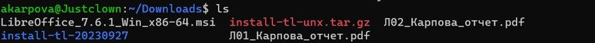{#fig:1 width=70%}

  Перехожу в распакованную папку и запускаю install-tl-* с правами root, используя sudo (рис. @fig:2)
  
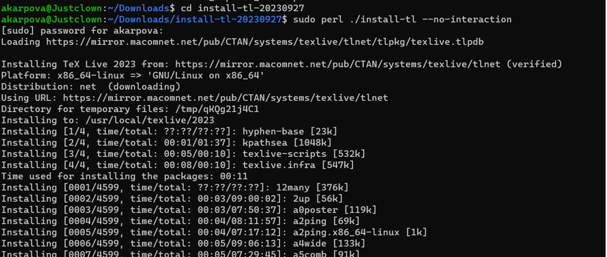{#fig:2 width=70%}

  Добавляю /usr/local/texlive/2022/bin/x86_64-linux в свой PATH для текущей и будущих сессий. (рис. @fig:3)
  
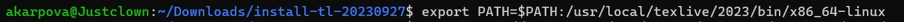{#fig:3 width=70%}

  Скачиваю архив pandoc (рис. @fig:4)
  
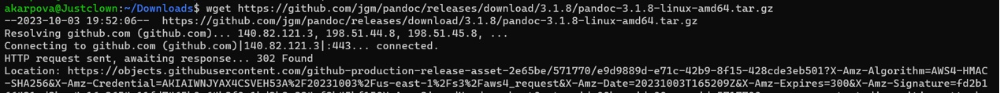{#fig:4 width=70%}

  Скачиваю архив pandoc-crossref (рис. @fig:5)
  
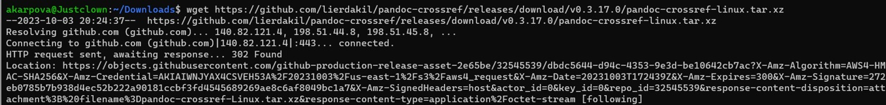{#fig:5 width=70%}
 
  Распаковываю скачанные архивы (рис. @fig:6)
  
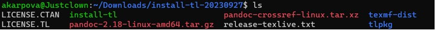{#fig:6 width=70%}

  Копирую файлы pandoc и pandoc-crossref в каталог /usr/local/bin/ с правами пользователя root используя sudo. Проверяю правильность. (рис. @fig:7)
  
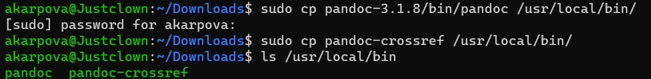{#fig:7 width=70%}

  Открывав терминал, перехожу в каталог курса, сформированный при выполненнии прошлой лаборатной работы. (рис. @fig:8)

{#fig:8 width=70%}

  Обновляю локальный репозиторий. (рис. @fig:9)

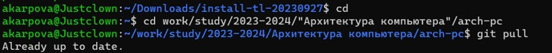{#fig:9 width=70%}

  Перехожу в каталог с шаблоном отчета по лабораторной работе №3 и компилирую шаблон с использованием Makefile, введя команду make (рис. @fig:10)
  
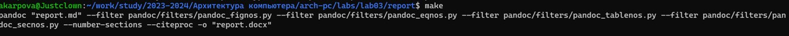{#fig:10 width=70%}

  Проверяю правильность выполнения команды. (рис. @fig:11)
  
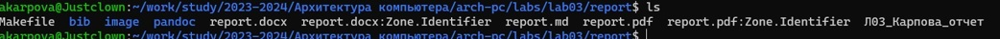{#fig:11 width=70%} 
  
  Открываю сгенерированный файл report.docx (рис. @fig:12)
  
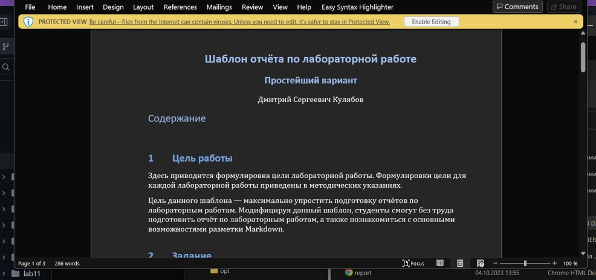{#fig:12 width=70%}
 
  Открываю сгенерированный файл report.pdf (рис. @fig:12)
  
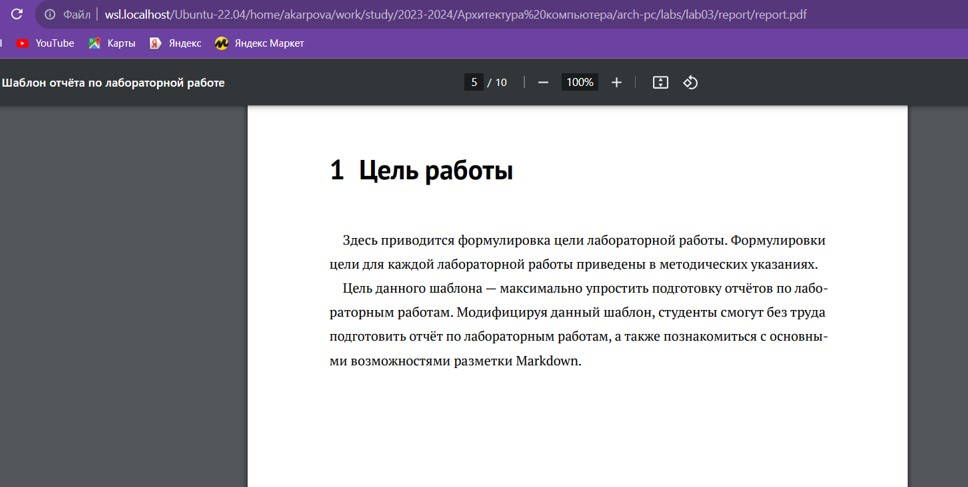{#fig:13 width=70%}
  
  Удаляю полученные файлы с использованием Makefile, вводя команду make clean. Проверяю. (рис. @fig:14)
  
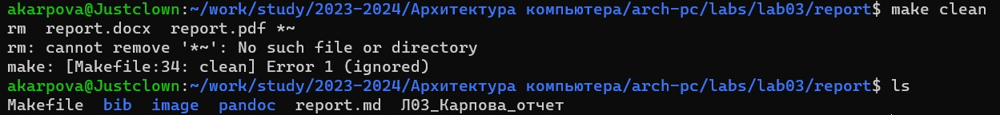{#fig:14 width=70%}
 
  Открываю файл report.md с помощью gedit и изучаю его (рис. @fig:15)
  
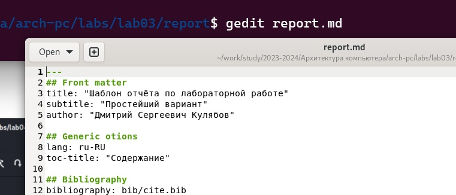{#fig:15 width=70%}
 
  Заполняю отчет с помощью разметки Markdown (рис. @fig:16)
  
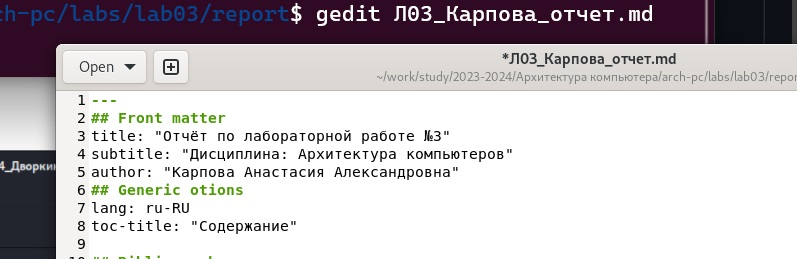{#fig:16 width=70%}

Выполнение заданий для лабораторной работы
  
  1. Перехожу в директорию lab02/report с помощью cd, чтобы там заполнять отчет по третьей лабораторной работе (рис. @fig:17)
  
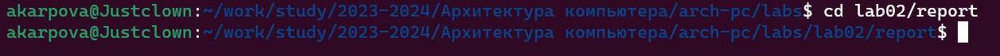{#fig:17 width=70%}
  
  2. Открываю файл с помощью текстового редактора gedit и начинаю заполнять отчет. Потот отправляю все на github (рис. @fig:18).
 
{#fig:17 width=70%} 
 
 
# Выводы

В ходе лабораторной работы я освоила процедуры оформления отчетов с помощью легковесного языка разметки Markdown

# Список литературы{.unnumbered}
1. Архитектура ЭВМ
::: {#refs}
:::
