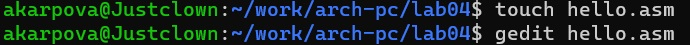
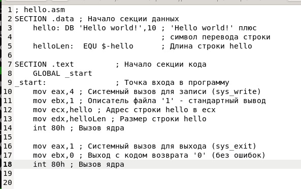
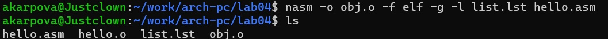
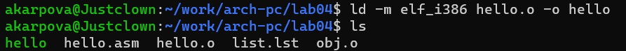
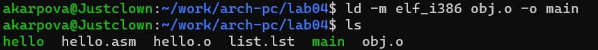
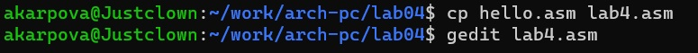
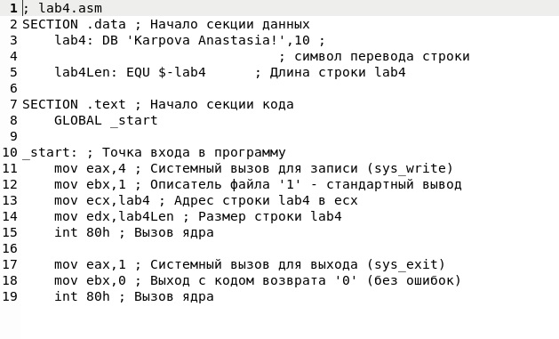
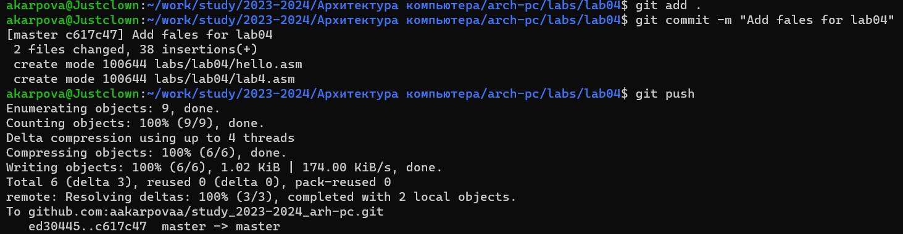

---
## Front matter
title: "Отчет по лабораторной работе №4"
subtitle: "Дисциплина: Архитектура компьютера"
author: "Карпова Анастасия Александровна"

## Generic otions
lang: ru-RU
toc-title: "Содержание"

## Bibliography
bibliography: bib/cite.bib
csl: pandoc/csl/gost-r-7-0-5-2008-numeric.csl

## Pdf output format
toc: true # Table of contents
toc-depth: 2
lof: true # List of figures
fontsize: 12pt
linestretch: 1.5
papersize: a4
documentclass: scrreprt
## I18n polyglossia
polyglossia-lang:
  name: russian
  options:
	- spelling=modern
	- babelshorthands=true
polyglossia-otherlangs:
  name: english
## I18n babel
babel-lang: russian
babel-otherlangs: english
## Fonts
mainfont: PT Serif
romanfont: PT Serif
sansfont: PT Sans
monofont: PT Mono
mainfontoptions: Ligatures=TeX
romanfontoptions: Ligatures=TeX
sansfontoptions: Ligatures=TeX,Scale=MatchLowercase
monofontoptions: Scale=MatchLowercase,Scale=0.9
## Biblatex
biblatex: true
biblio-style: "gost-numeric"
biblatexoptions:
  - parentracker=true
  - backend=biber
  - hyperref=auto
  - language=auto
  - autolang=other*
  - citestyle=gost-numeric
## Pandoc-crossref LaTeX customization
figureTitle: "Рис."
tableTitle: "Таблица"
listingTitle: "Листинг"
lofTitle: "Список иллюстраций"
lolTitle: "Листинги"
## Misc options
indent: true
header-includes:
  - \usepackage{indentfirst}
  - \usepackage{float} # keep figures where there are in the text
  - \floatplacement{figure}{H} # keep figures where there are in the text
---

# Цель работы

Освоение процедуры компиляции и сборки программ, написанных на ассемблере NASM.

# Задание

1. Созание программы Hello world!
2. Работа с транслятором NASM
3. Работа с расширенным синтаксисом командной строки NASM
4. Работа с компоновщиком LD
5. Запуск исполняемого файла
6. Выполнение заданий для самостоятельной работы

# Теоретическое введение

Основными функциональными элементами любой электронно-вычислительной машины
(ЭВМ) являются центральный процессор, память и периферийные устройства
Взаимодействие этих устройств осуществляется через общую шину, к которой они подключены. Физически шина представляет собой большое количество проводников, соединяющих
устройства друг с другом. В современных компьютерах проводники выполнены в виде электропроводящих дорожек на материнской (системной) плате.
Основной задачей процессора является обработка информации, а также организация
координации всех узлов компьютера. В состав центрального процессора (ЦП) входят
следующие устройства:
• арифметико-логическое устройство (АЛУ) — выполняет логические и арифметические действия, необходимые для обработки информации, хранящейся в памяти;
• устройство управления (УУ) — обеспечивает управление и контроль всех устройств
компьютера;
• регистры — сверхбыстрая оперативная память небольшого объёма, входящая в состав процессора, для временного хранения промежуточных результатов выполнения
инструкций; регистры процессора делятся на два типа: регистры общего назначения и
специальные регистры.
Для того, чтобы писать программы на ассемблере, необходимо знать, какие регистры
процессора существуют и как их можно использовать. Большинство команд в программах
написанных на ассемблере используют регистры в качестве операндов. Практически все
команды представляют собой преобразование данных хранящихся в регистрах процессора,
это например пересылка данных между регистрами или между регистрами и памятью, преобразование (арифметические или логические операции) данных хранящихся в регистрах.
Доступ к регистрам осуществляется не по адресам, как к основной памяти, а по именам.
Каждый регистр процессора архитектуры x86 имеет свое название, состоящее из 2 или 3
букв латинского алфавита.
Другим важным узлом ЭВМ является оперативное запоминающее устройство (ОЗУ).
ОЗУ — это быстродействующее энергозависимое запоминающее устройство, которое напрямую взаимодействует с узлами процессора, предназначенное для хранения программ и
данных, с которыми процессор непосредственно работает в текущий момент. ОЗУ состоит из
одинаковых пронумерованных ячеек памяти. Номер ячейки памяти — это адрес хранящихся
в ней данных.
В основе вычислительного процесса ЭВМ лежит принцип программного управления.
Это означает, что компьютер решает поставленную задачу как последовательность действий,
записанных в виде программы.
Язык ассемблера (assembly language, сокращённо asm) — машинно-ориентированный
язык низкого уровня. Можно считать, что он больше любых других языков приближен к
архитектуре ЭВМ и её аппаратным возможностям, что позволяет получить к ним более
полный доступ, нежели в языках высокого уровня,таких как C/C++, Perl, Python и пр.Следует отметить, что процессор понимает не команды ассемблера, а последовательности
из нулей и единиц — машинные коды

# Выполнение лабораторной работы
Программа Hello world!

Создаю каталог для работы с программами на языке ассемблера NASM и перехожу в созданный каталог (рис. @fig:001).

{#fig:001 width=70%}

Создаю текстовый файл с именем hello.asm и открываю его в gedit (рис. @fig:002)

{#fig:002 width=70%}

Ввожу следующий текст (рис. @fig:003)
 
{#fig:003 width=70%}
Транслятор NASM

NASM превращает текст программы в объектный код. Для компиляции приведённого выше текста программы «Hello World» необходимо написать следующее. (рис. @fig:004)

{#fig:004 width=70%}

Расширенный синтаксис командной строки NASM

Ввожу команду, которая скомпилирует файл hello.asm в файл obj.o (рис. @fig:005)

{#fig:005 width=70%}

Компоновщик LD

Передаю объектный файл hello.o на обработку компоновщику LD, чтобы получить файд hello (рис. @fig:006)

{#fig:006 width=70%}

Ключ -o с последующим значением задаёт в данном случае имя создаваемого исполняемого файла. Поэтому ввожу следующую команду (рис. @fig:007)

{#fig:007 width=70%}

Запуск исполняемого файла

Запускаю на выполнение созданный исполняемый файл, находящийся в текущем каталоге набрав в командной строке следующее (рис. @fig:008)

{#fig:008 width=70%}

Выполнение заданий для самостоятельной работы

В каталоге ~/work/arch-pc/lab04 с помощью команды cp создайте копию файла
hello.asm с именем lab4.asm и открываю lab4.asm при помощи gedit, редактирую (рис. @fig:009) (рис. @fig:010)

{#fig:009 width=70%}

{#fig:010 width=70%}

Компилирую текст программы в объектный файл (рис. @fig:011)

{#fig:011 width=70%}

Передаю объектный файл lab4.o на обработку компоновщику LD (рис. @fig:012)

{#fig:012 width=70%} 

Запускаю исполняемый файл. (рис. @fig:013)

{#fig:013 width=70%} 

Отправляю все файлы на git (рис. @fig:014)

{#fig:014 width=70%}

# Выводы

В ходе лабораторной работы я освоила процедуры компиляции и сборки программ, написанных на ассемблере NASM.

# Список литературы{.unnumbered}

1. Архитектура ЭВМ
::: {#refs}
:::
