---
## Front matter
title: "Отчёт по лабораторной работе №5"
subtitle: "Дисциплина: Архитектура компьтеров"
author: "Карпова Анастасия Александровна"

## Generic otions
lang: ru-RU
toc-title: "Содержание"

## Bibliography
bibliography: bib/cite.bib
csl: pandoc/csl/gost-r-7-0-5-2008-numeric.csl

## Pdf output format
toc: true # Table of contents
toc-depth: 2
lof: true # List of figures
fontsize: 12pt
linestretch: 1.5
papersize: a4
documentclass: scrreprt
## I18n polyglossia
polyglossia-lang:
  name: russian
  options:
	- spelling=modern
	- babelshorthands=true
polyglossia-otherlangs:
  name: english
## I18n babel
babel-lang: russian
babel-otherlangs: english
## Fonts
mainfont: PT Serif
romanfont: PT Serif
sansfont: PT Sans
monofont: PT Mono
mainfontoptions: Ligatures=TeX
romanfontoptions: Ligatures=TeX
sansfontoptions: Ligatures=TeX,Scale=MatchLowercase
monofontoptions: Scale=MatchLowercase,Scale=0.9
## Biblatex
biblatex: true
biblio-style: "gost-numeric"
biblatexoptions:
  - parentracker=true
  - backend=biber
  - hyperref=auto
  - language=auto
  - autolang=other*
  - citestyle=gost-numeric
## Pandoc-crossref LaTeX customization
figureTitle: "Рис."
tableTitle: "Таблица"
listingTitle: "Листинг"
lofTitle: "Список иллюстраций"
lolTitle: "Листинги"
## Misc options
indent: true
header-includes:
  - \usepackage{indentfirst}
  - \usepackage{float} # keep figures where there are in the text
  - \floatplacement{figure}{H} # keep figures where there are in the text
---

# Цель работы

Приобретение практических навыков работы в Midnight Commander. Освоение инструкций
языка ассемблера mov и int.ё

# Задание

1. Основы работы с mc
2. Структура программы на языке ассемблера NASM
3. Подключение внешнего файла
4. Выполнение заданий для самостоятельной работы

# Теоретическое введение

Midnight Commander (или просто mc) — это программа, которая позволяет просматривать структуру каталогов и выполнять основные операции по управлению файловой системой, т.е. mc является файловым менеджером. Midnight Commander позволяет сделать работу с файлами более удобной и наглядной. Программа на языке ассемблера NASM, как правило, состоит из трёх секций: секция кода программы (SECTION .text), секция инициированных (известных во время компиляции) данных (SECTION .data) и секция неинициализированных данных (тех, под которые во время компиляции только отводится память, а значение присваивается в ходе выполнения программы) (SECTION .bss). Для объявления инициированных данных в секции .data используются директивы DB, DW, DD, DQ и DT, которые резервируют память и указывают, какие значения должны храниться в этой памяти:

DB (define byte) — определяет переменную размером в 1 байт;
DW (define word) — определяет переменную размеров в 2 байта (слово);
DD (define double word) — определяет переменную размером в 4 байта (двойное слово);
DQ (define quad word) — определяет переменную размером в 8 байт (учетве- рённое слово);
DT (define ten bytes) — определяет переменную размером в 10 байт. Директивы используются для объявления простых переменных и для объявления массивов. Для определения строк принято использовать директиву DB в связи с особенностями хранения данных в оперативной памяти. Инструкция языка ассемблера mov предназначена для дублирования данных источника в приёмнике.
mov dst,src
Здесь операнд dst — приёмник, а src — источник. В качестве операнда могут выступать регистры (register), ячейки памяти (memory) и непосредственные значения (const). Инструкция языка ассемблера intпредназначена для вызова прерывания с указанным номером.
int n
Здесь n — номер прерывания, принадлежащий диапазону 0–255. При программировании в Linux с использованием вызовов ядра sys_calls n=80h (принято задавать в шестнадцатеричной системе счисления).

# Выполнение лабораторной работы

Основы работы с mc
  
Открываю Midhight Commander, введя mc в терминал (рис. @fig:1).

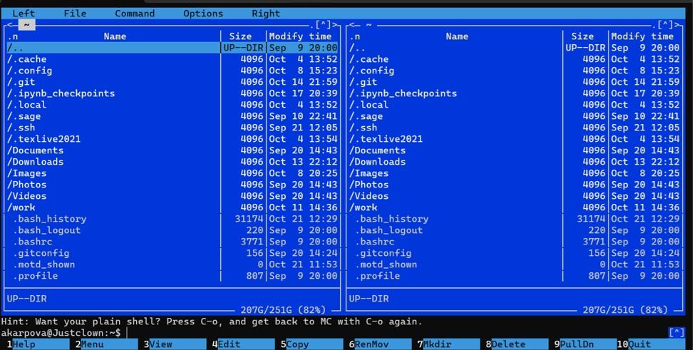{#fig:1 width=70%}

Перехожу в каталог ~/work/arch-pc и создаю в нем каталог lab05, перехожу в этот каталог (рис. @fig:2).
  
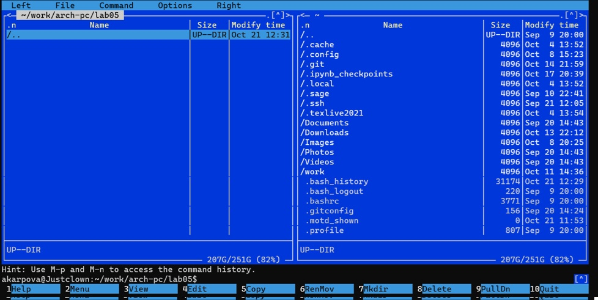{#fig:2 width=70%}]

Создаю файл lab5-1.asm пр (и помощи команды touch (рис. @fig:3)

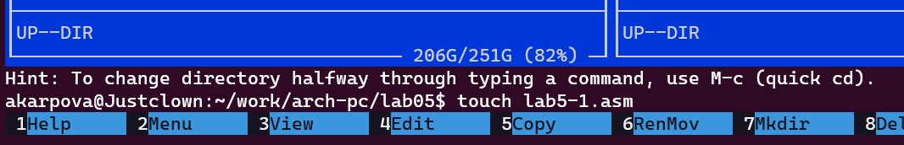{#fig:3 width=70%}] 
    
Структура программы на языке ассемблера NASM
    
При помощи клавиши f4 открываю файл lab5-1.asm для редактирования в nano (рис. @fig:4)
  
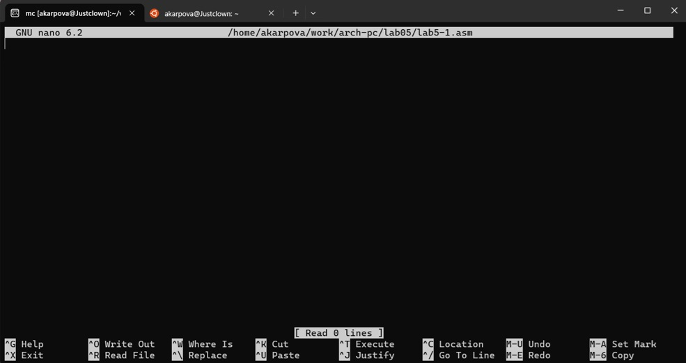{#fig:4 width=70%}] 

Ввожу в файл код программы для запроса строки у пользователя. Потом выхожу из файла при помощи Ctrl+X, сохранив изменения - Y, Enter. (рис. @fig:5)
  
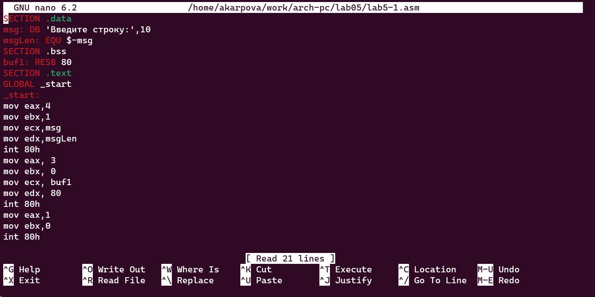{#fig:5 width=70%}]

Проверяю файл на содержание кода при помощи f3(для просмотра файла) (рис. @fig:6)
  
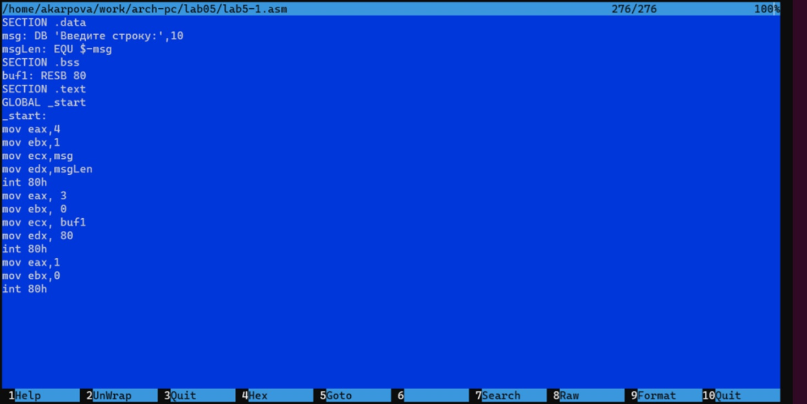{#fig:6 width=70%}]

Транслирую текст программы в объектный файл командой nasm -f elf lab5-1.asm (создался объектный файл lab5-1.o). Затем выполняю компоновку объектного файла при помощи команды ld -m elf_i386 -o lab5-1 lab5-1.o. (рис. @fig:7)
  
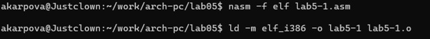{#fig:7 width=70%}]

Запускаю исполняемый файл. (Программа выводит строку "Введите строку" - соответственно мы вводим своё ФИО и программа заканчивает свою работу, выведя наше ФИО (рис. @fig:8)
  
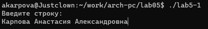{#fig:8 width=70%}]

Запуск исполняемого файла
    
Скачиваю файл in_out.asm из ТУИСа. (рис. @fig:9)
  
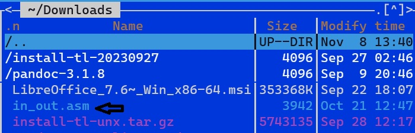{#fig:9 width=70%}]

С помощью функциональной клавиши f5 копирую файл in_out.asm из каталога Downloads в созданный каталог lab05. (рис. @fig:10)

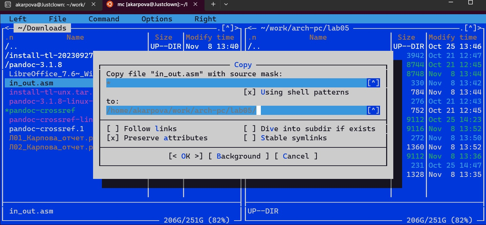{#fig:10 width=70%}]

С помощью функциональной клавиши f5 копирую файл lab5-1 в тот же каталог, но с другим именем, для этого в появившемся окне mc прописываю имя для копии файла. (рис. @fig:11)
  
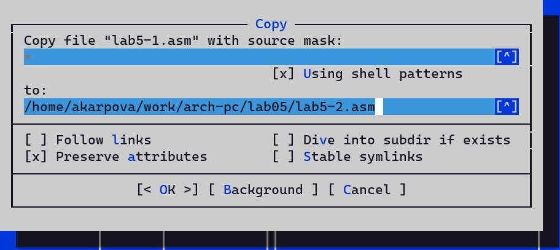{#fig:11 width=70%}]

Изменяю содержимое файла lab5-2.asm редакторе nano, чтобы в программе использовались подпрограммы из внешнего файла in_out.asm. (рис. @fig:012)
  
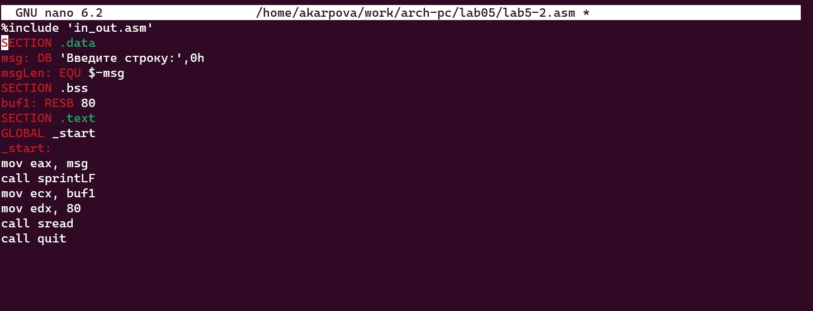{#fig:12 width=70%}]

Транслирую текст программы файла в объектный файл командой nasm -f elf lab5-2.asm (Создался объектный файл lab5-2.o). Выполняю компоновку объектного файла с помощью команды ld -m elf_i386 -o lab5-2 lab5-2.o (Создался исполняемый файл lab5-2). Запускаю исполняемый файл. (рис. @fig:013)
  
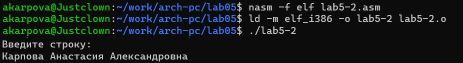{#fig:13 width=70%}]

Открываю файл lab5-2.asm в редакторе в nano функциональной клавишей f4. Изменяю в нем подпрограмму sprintLF на sprint. Сохраняю изменения и открываю файл для просмотра, чтобы проверить сохранение действий. (рис. @fig:14)
  
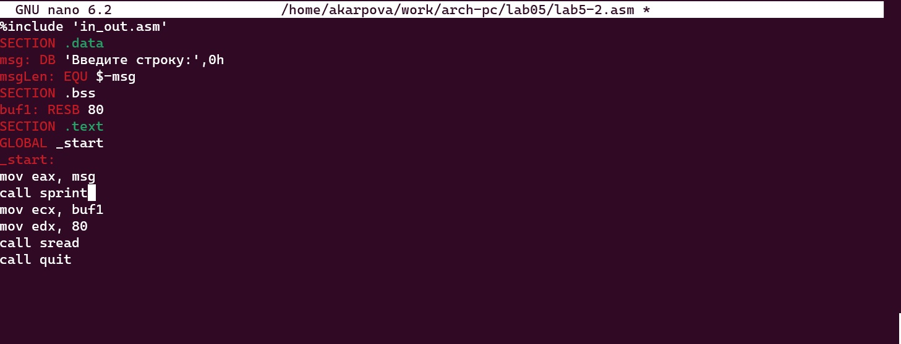{#fig:14 width=70%}]

Снова транслирую файл, выполняю компоновку созданного объектного файла, запускаю новый исполняемый файл. (рис. @fig:15)
  
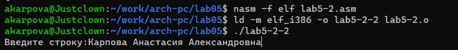{#fig:15 width=70%}]

Выполнение заданий для самостоятельной работы
    
1. Создаю копию файла lab5-1.asm с именем lab5-1-1.asm с помощью клавиши f5. (рис. @fig:16)
   
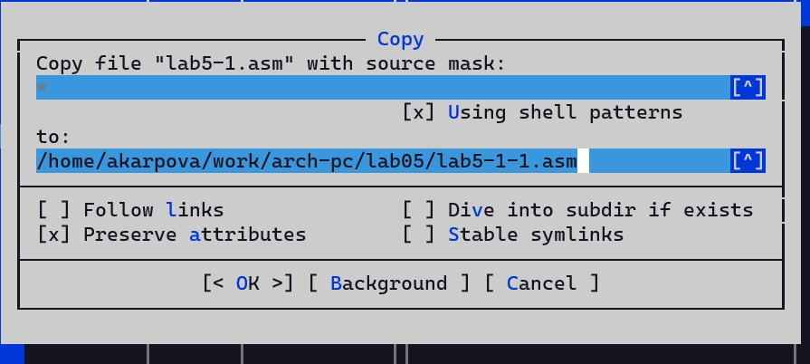{#fig:16 width=70%}]

С помощью клавиши f4 открываю созданный файл для редактирования. Изменяю программу так, чтобы кроме вывода приглашения и запроса ввода, она выводила вводимую пользователем строку. (рис. @fig:17)
   
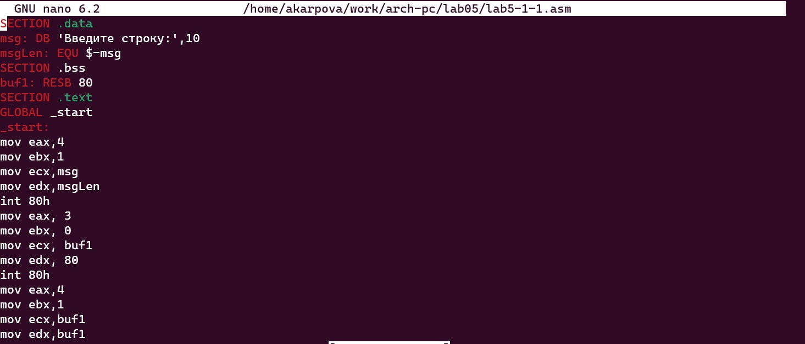{#fig:17 width=70%}]
  
2. Создаю объектный файл lab5-1-1.o, отдаю его на обработку компоновщику, получаю исполняемый файл lab5-1-1, запускаю полученный исполняемый файл. Программа запрашивает ввод, ввожу свои ФИО, и программа соответственно выводит введенные мною данные (рис. @fig:18)
   
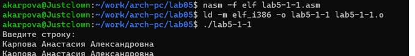{#fig:18 width=70%}]

3. Создаю копию файла lab5-2.asm с именем lab5-2-1.asm с помощью клавиши f5. (рис. @fig:19)
   
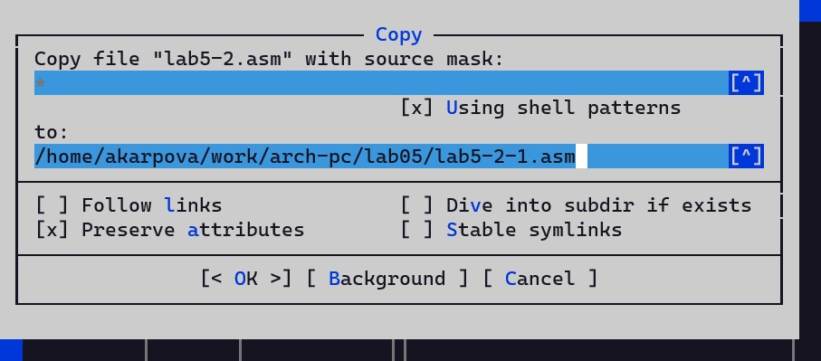{#fig:19 width=70%}]

С помощью клавиши f4 открываю созданный файл для редактирования. Изменяю программу так, чтобы кроме вывода приглашения и запроса ввода, она выводила вводимую пользователем строку. (рис. @fig:20)
   
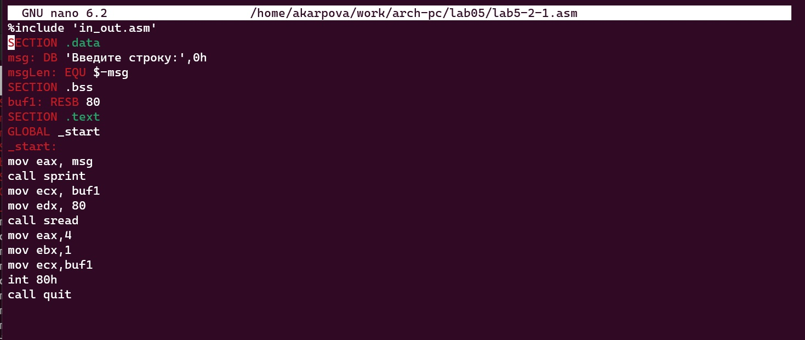{#fig:20 width=70%}]

4. Создаю объектный файл lab5-2-1.o, отдаю его на обработку компоновщику, получаю исполняемый файл lab5-2-1, запускаю полученный исполняемый файл. Программа запрашивает ввод без переноса на новую строку, ввожу свои ФИО, далее программа выводит введенные мною данные. (рис. @fig:21)
   
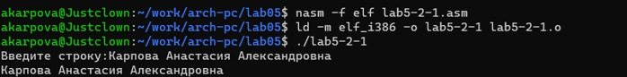{#fig:21 width=70%}]

# Выводы

В ходе выполнения лабораторной работы я приобрела практические навыки работы в Midnight Commander, а также освоила инструкции языка ассемблера mov и int.

# Список литературы

1. Архитектура ЭВМ
