---
## Front matter
title: "Отчёт по лабораторной работе №6"
subtitle: "Дисциплина: Архитектура компьютеров"
author: "Карпова Анастасия Александровна"

## Generic otions
lang: ru-RU
toc-title: "Содержание"

## Bibliography
bibliography: bib/cite.bib
csl: pandoc/csl/gost-r-7-0-5-2008-numeric.csl

## Pdf output format
toc: true # Table of contents
toc-depth: 2
lof: true # List of figures
fontsize: 12pt
linestretch: 1.5
papersize: a4
documentclass: scrreprt
## I18n polyglossia
polyglossia-lang:
  name: russian
  options:
	- spelling=modern
	- babelshorthands=true
polyglossia-otherlangs:
  name: english
## I18n babel
babel-lang: russian
babel-otherlangs: english
## Fonts
mainfont: PT Serif
romanfont: PT Serif
sansfont: PT Sans
monofont: PT Mono
mainfontoptions: Ligatures=TeX
romanfontoptions: Ligatures=TeX
sansfontoptions: Ligatures=TeX,Scale=MatchLowercase
monofontoptions: Scale=MatchLowercase,Scale=0.9
## Biblatex
biblatex: true
biblio-style: "gost-numeric"
biblatexoptions:
  - parentracker=true
  - backend=biber
  - hyperref=auto
  - language=auto
  - autolang=other*
  - citestyle=gost-numeric
## Pandoc-crossref LaTeX customization
figureTitle: "Рис."
tableTitle: "Таблица"
listingTitle: "Листинг"
lofTitle: "Список иллюстраций"
lolTitle: "Листинги"
## Misc options
indent: true
header-includes:
  - \usepackage{indentfirst}
  - \usepackage{float} # keep figures where there are in the text
  - \floatplacement{figure}{H} # keep figures where there are in the text
---

# Цель работы

Освоение арифметических инструкций языка ассемблера NASM.

# Задание

1. Символьные и численные данные в NASM
2. Выполнение арифметических действий в NASM
3. Выполнение заданий для самостоятельной работы

# Теоретическое введение

Большинство инструкций на языке ассемблера требуют обработки операндов. Адрес операнда предоставляет место, где хранятся данные, подлежащие обработке. Это могут быть
данные хранящиеся в регистре или в ячейке памяти. Далее рассмотрены все существующие
способы задания адреса хранения операндов – способы адресации.
Существует три основных способа адресации:
• Регистровая адресация – операнды хранятся в регистрах и в команде используются
имена этих регистров, например: mov ax,bx.
• Непосредственная адресация – значение операнда задается непосредственно в команде, Например: mov ax,2.
• Адресация памяти – операнд задает адрес в памяти. В команде указывается символическое обозначение ячейки памяти, над содержимым которой требуется выполнить
операцию.
Ввод информации с клавиатуры и вывод её на экран осуществляется в символьном виде.
Кодирование этой информации производится согласно кодовой таблице символов ASCII.
ASCII – сокращение от American Standard Code for Information Interchange (Американский
стандартный код для обмена информацией). Согласно стандарту ASCII каждый символ
кодируется одним байтом. Среди инструкций NASM нет такой, которая выводит числа (не в символьном виде). Поэтому, например, чтобы вывести число, надо предварительно преобразовать его цифры в
ASCII-коды этих цифр и выводить на экран эти коды, а не само число. Если же выводить число
на экран непосредственно, то экран воспримет его не как число, а как последовательность
ASCII-символов – каждый байт числа будет воспринят как один ASCII-символ – и выведет на
экран эти символы.
Для выполнения лабораторных работ в файле in_out.asm реализованы подпрограммы
для преобразования ASCII символов в числа и обратно. Это:
• iprint – вывод на экран чисел в формате ASCII, перед вызовом iprint в регистр eax
необходимо записать выводимое число (mov eax,<int>).
• iprintLF – работает аналогично iprint, но при выводе на экран после числа добавляет
к символ перевода строки.
• atoi – функция преобразует ascii-код символа в целое число и записает результат
в регистр eax, перед вызовом atoi в регистр eax необходимо записать число (mov
eax,<int>).

# Выполнение лабораторной работы

4.1 Символьные и численные данные в NASM

C помощью mkdir создаю каталог lab06 в ~/work/arch-pc. Перехожу в созданный каталог с помощью утилиты cd (рис. @fig:001).

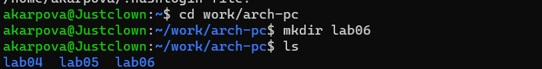{#fig:001 width=70%}

С помощью утилиты touch создаю файл lab7-1.asm (рис. @fig:002).

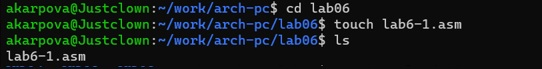{#fig:002 width=70%}

Копирую в текущий каталог файл in_out.asm с помощью утилиты cp (рис. @fig:003).

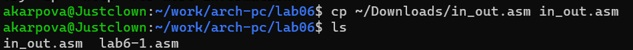{#fig:003 width=70%}

Открываю созданный файл lab7-1.asm, вставляю в него программу вывода значения регистра eax (рисю @fig:004).

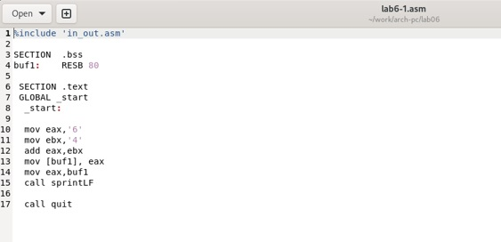{#fig:004 width=70%}

Создаю исполняемый файл программы и запускаю его. Вывод программы: символ j, потому что программа вывела символ, соответствующий по системе ASCII сумме двоичных кодов символов 4 и 6. (рис. @fig:005)

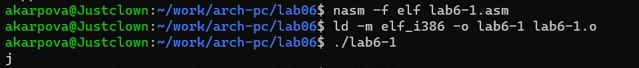{#fig:005 width=70%}

Изменяю в тексте программы символы "6" и "4" на цифры 6 и 4 (рис. @fig:006)

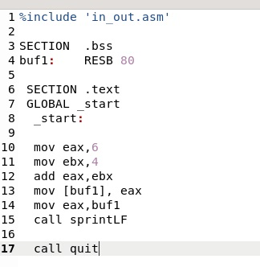{#fig:006 width=70%}

Создаю новый исполняемый файл и запускаю его. Теперь вывелся символ с кодом 10, это символ перевода строки, этот символ не отображается при выводе на экран (рис. @fig:007)

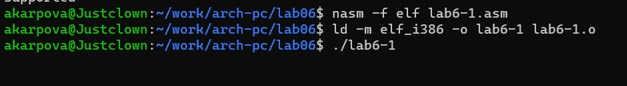{#fig:007 width=70%}

C помощью touch cоздаю новый файл lab6-2.asm (рис. @fig:008)

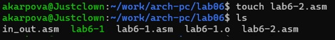{#fig:008 width=70%}

Ввожу в файл текст другой программы для вывода значения регистра eax (рис. @fig:009).

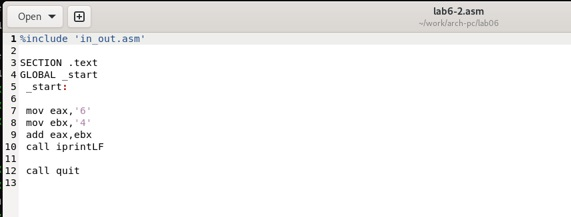{#fig:009 width=70%}

Создаю и запускаю исполняемый файл lab6-2. Теперь выводится число 106, потому что программа позволяет вывести именно число, а не символ, хотя все еще происходит именно сложение кодов символов "6" и "4" (рис. @fig:010)

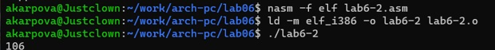{#fig:010 width=70%}

Заменяю в тексте программы в файле lab6-2.asm символы "6" и "4" на числа 6 и 4 (рис. @fig:011)

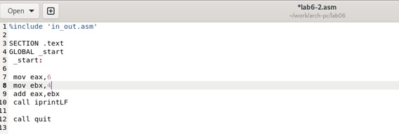{#fig:011 width=70%}

Создаю и запускаю новый исполняемый файл. Теперь программа складывает не соответствующие символам коды в системе ASCII, а сами числа, поэтому вывод 10 (рис. @fig:012)

{#fig:012 width=70%}

Заменяю в тексте программы функцию iprintLF на iprint (рис. @fig:013)

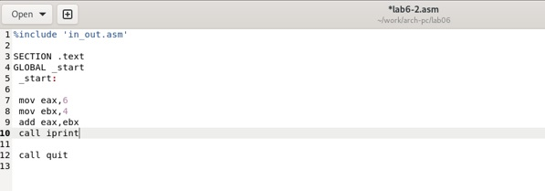{#fig:013 width=70%}

Создаю и запускаю новый исполняемый файл. Вывод не изменяется, потому что символ переноса строки не отображался, когда программа исполнялась с функцией iprintLF, а iprint не добавляет к выводу символ переноса строки, в отличие от iprintLF (рис. @fig:014)

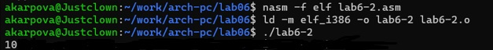{#fig:014 width=70%}

4.2 Выполнение арифметических операций в NASM

Создаю файл lab6-3.asm с помощью touch (рис. @fig:015)

{#fig:015 width=70%}

Ввожу в созданный файл текст программы для вычисления значения выражения f(x) = (5 * 2 + 3)/3 (рис. @fig:016)

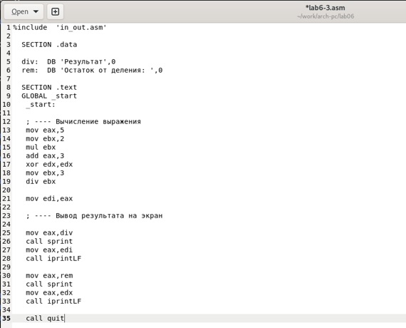{#fig:016 width=70%}

Создаю исполняемый файл и запускаю его (рис. @fig:017)

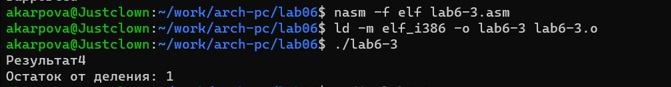{#fig:017 width=70%}

Изменяю программу так, чтобы она вычисляла значение выражения f(x) = (4 * 6 + 2)/5 (рис. @fig:018)

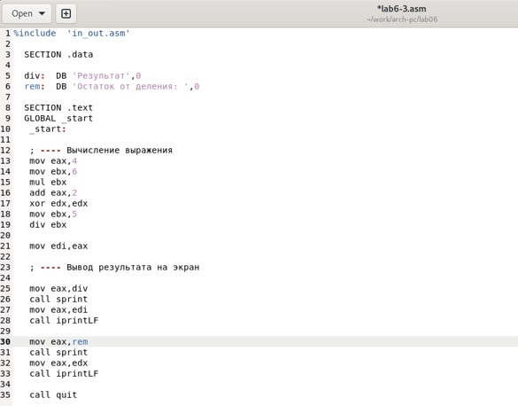{#fig:018 width=70%}

Создаю и запускаю новый исполняемый файл (рис. @fig:019)

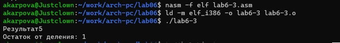{#fig:019 width=70%}

Создаю файл variant.asm с помощью утилиты touch (рис. @fig:020)

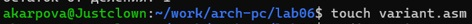{#fig:020 width=70%}

Ввожу в файл текст программы для вычисления варианта задания по номеру студенческого билета (рис. @fig:021).

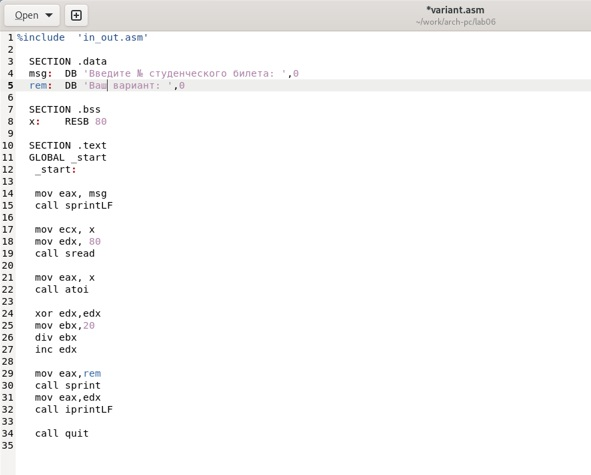{#fig:021 width=70%}

Создаю и запускаю исполняемый файл. Ввожу номер своего студ. билета программа вывела, что мой вариант - 15 (рис. @fig:22)

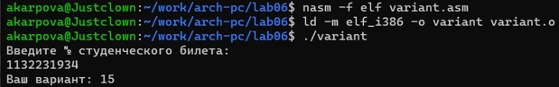{#fig:022 width=70%}

4.2.1 Ответы на вопросы по программе

1. За вывод сообщения "Ваш вариант" отвечают строки кода:

mov eax,rem
call sprint

2. Инструкция mov ecx, x используется, чтобы положить адрес вводимой строки x в регистр ecx mov edx, 80 - запись в регистр edx длины вводимой строки call sread - вызов подпрограммы из внешнего файла, обеспечивающей ввод сообщения с клавиатуры

3. call atoi используется для вызова подпрограммы из внешнего файла, которая преобразует ascii-код символа в целое число и записывает результат в регистр eax

4. За вычисления варианта отвечают строки:

xor edx,edx 
mov ebx,20 ; ebx = 20
div ebx 
inc edx 

5. При выполнении инструкции div ebx остаток от деления записывается в регистр edx

6. Инструкция inc edx увеличивает значение регистра edx на 1

7. За вывод на экран результатов вычислений отвечают след. строки:

mov eax,edx
call iprintLF

4.3 Выполнение заданий для самостоятельной работы

Создаю файл lab6-4.asm с помощью touch (рис. @fig:023)

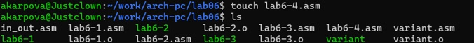{#fig:023 width=70%}

Открываю созданный файл для редактирования, ввожу в него текст программы для вычисления значения выражения (5+x)^2-3 (рис. @fig:024)

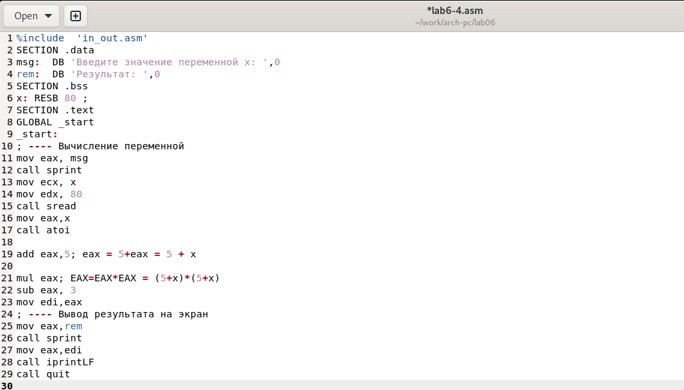{#fig:024 width=70%}

Создаю и запускаю исполняемый файл (рис. @fig:025). При вводе значения 5, вывод - 97; 1 - 33.

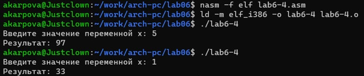{#fig:025 width=70%}

# Выводы

При выполнении данной лабораторной работы я освоила арифметические инструкции языка ассемблера NASM

# Список литературы{.unnumbered}

1. Архитектура ЭВМ

::: {refs}
:::
