---
## Front matter
title: "Отчёт по лабораторной работе"
subtitle: "Дисциплина: Архитектура компьютера"
author: "Карпова Анастасия Александровна"

## Generic otions
lang: ru-RU
toc-title: "Содержание"

## Bibliography
bibliography: bib/cite.bib
csl: pandoc/csl/gost-r-7-0-5-2008-numeric.csl

## Pdf output format
toc: true # Table of contents
toc-depth: 2
lof: true # List of figure
fontsize: 12pt
linestretch: 1.5
papersize: a4
documentclass: scrreprt
## I18n polyglossia
polyglossia-lang:
  name: russian
  options:
	- spelling=modern
	- babelshorthands=true
polyglossia-otherlangs:
  name: english
## I18n babel
babel-lang: russian
babel-otherlangs: english
## Fonts
mainfont: PT Serif
romanfont: PT Serif
sansfont: PT Sans
monofont: PT Mono
mainfontoptions: Ligatures=TeX
romanfontoptions: Ligatures=TeX
sansfontoptions: Ligatures=TeX,Scale=MatchLowercase
monofontoptions: Scale=MatchLowercase,Scale=0.9
## Biblatex
biblatex: true
biblio-style: "gost-numeric"
biblatexoptions:
  - parentracker=true
  - backend=biber
  - hyperref=auto
  - language=auto
  - autolang=other*
  - citestyle=gost-numeric
## Pandoc-crossref LaTeX customization
figureTitle: "Рис."
tableTitle: "Таблица"
listingTitle: "Листинг"
lofTitle: "Список иллюстраций"
lolTitle: "Листинги"
## Misc options
indent: true
header-includes:
  - \usepackage{indentfirst}
  - \usepackage{float} # keep figures where there are in the text
  - \floatplacement{figure}{H} # keep figures where there are in the text
---

# Цель работы

Изучение команд условного и безусловного переходов. Приобретение навыков написания
программ с использованием переходов. Знакомство с назначением и структурой файла
листинга.

# Задание

1. Реализация переходов в NASM
2. Изучение структуры файлы листинга
3. Выполнение заданий для самостоятельной работы

# Теоретическое введение

Для реализации ветвлений в ассемблере используются так называемые команды передачи
управления или команды перехода. Можно выделить 2 типа переходов:
• условный переход – выполнение или не выполнение перехода в определенную точку
программы в зависимости от проверки условия.
• безусловный переход – выполнение передачи управления в определенную точку программы без каких-либо условий.
Безусловный переход выполняется инструкцией jmp (от англ. jump – прыжок), которая
включает в себя адрес перехода, куда следует передать управление:
jmp <адрес_перехода>
Адрес перехода может быть либо меткой, либо адресом области памяти, в которую предварительно помещен указатель перехода.
Как отмечалось выше, для условного перехода необходима проверка какого-либо условия.
В ассемблере команды условного перехода вычисляют условие перехода анализируя флаги
из регистра флагов.
Инструкция cmp является одной из инструкций, которая позволяет сравнить операнды и
выставляет флаги в зависимости от результата сравнения.
Инструкция cmp является командой сравнения двух операндов и имеет такой же формат,
как и команда вычитания:
cmp <операнд_1>, <операнд_2>
Команда cmp, так же как и команда вычитания, выполняет вычитание <операнд_2> -
<операнд_1>, но результат вычитания никуда не записывается и единственным результатом
команды сравнения является формирование флагов.
Команда условного перехода имеет вид
j<мнемоника перехода> label
Мнемоника перехода связана со значением анализируемых флагов или со способом формирования этих флагов.
В табл. 7.3. представлены команды условного перехода, которые обычно ставятся после
команды сравнения cmp. В их мнемокодах указывается тот результат сравнения, при котором
надо делать переход. Мнемоники, идентичные по своему действию, написаны в таблице
через дробь (например, ja и jnbe). Программист выбирает, какую из них применить, чтобы
получить более простой для понимания текст программы.
Листинг (в рамках понятийного аппарата NASM) — это один из выходных файлов, создаваемых транслятором. Он имеет текстовый вид и нужен при отладке программы, так как
кроме строк самой программы он содержит дополнительную информацию.

# Выполнение лабораторной работы

7.1. Реализация переходов в NASM

Создаю каталог для программам лабораторной работы № 7, перехожу в него и создаю файл lab7-1.asm: (рис. @fig:001).

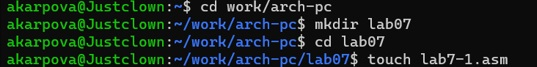{#fig:001 width=70%}

Инструкция jmp в NASM используется для реализации безусловных переходов. Рассмотрим пример программы с использованием инструкции jmp. Ввожу в файл lab7-1.asm текст программы из листинга 7.1. (рис. @fig:002)

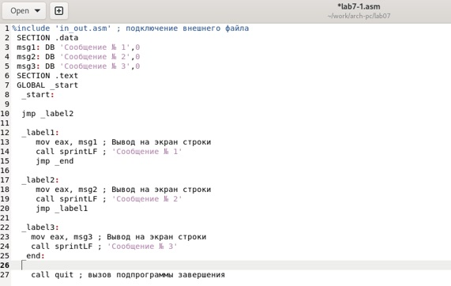{#fig:002 width=70%}

Создаю исполняемый файл и запускаю его. Результат работы данной программы будет следующим:
Сообщение № 2
Сообщение № 3 (рис. @fig:003)

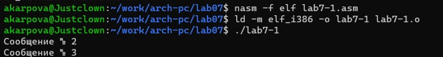{#fig:003 width=70%}

Таким образом, использование инструкции jmp _label2 меняет порядок исполнения
инструкций и позволяет выполнить инструкции начиная с метки _label2, пропустив вывод
первого сообщения.

Инструкция jmp позволяет осуществлять переходы не только вперед но и назад. Изменим
программу таким образом, чтобы она выводила сначала ‘Сообщение № 2’, потом ‘Сообщение
№ 1’ и завершала работу. Для этого в текст программы после вывода сообщения № 2 добавляю
инструкцию jmp с меткой _label1 (т.е. переход к инструкциям вывода сообщения № 1)
и после вывода сообщения № 1 добавляю инструкцию jmp с меткой _end (т.е. переход к
инструкции call quit). Изменяю текст программы в соответствии с листингом 7.2. (рис. @fig:004)

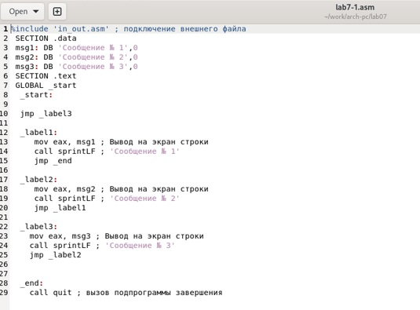{#fig:004 width=70%}

Создаю исполняемый файл и запускаю его. (рис. @fig:005)

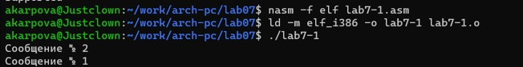{#fig:005 width=70%}

Изменяю текст программы добавив в начале программы jmp_label3(вместо label2), jmp_label2 в конце метки jmp_label3, jmp_label1 добавляю в конце метки jmp_label2, в конце метки jmp_label1 добавляю jmp_end, чтобы вывод программы был следующим:
Сообщение № 3
Сообщение № 2
Сообщение № 1 (рис. @fig:006)

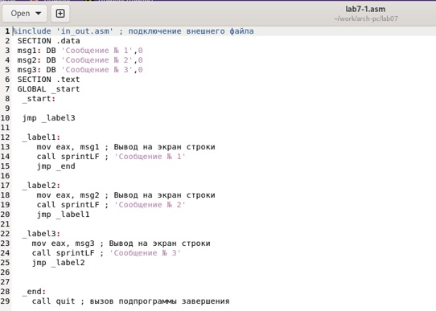{#fig:006 width=70%}

Рассмотрим программу, которая определяет и выводит на экран наибольшую из 3 целочисленных
переменных: A,B и C. Значения для A и C задаются в программе, значение B вводиться с клавиатуры.

Создайте файл lab7-2.asm в каталоге ~/work/arch-pc/lab07. Внимательно изучаю текст
программы из листинга 7.3 и ввожу в lab7-2.asm.

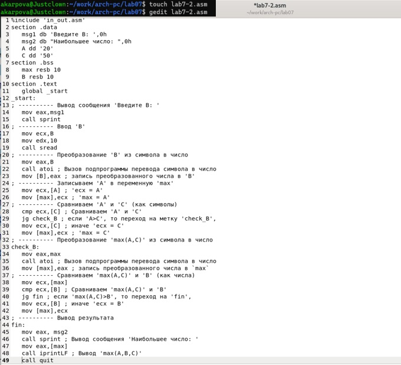{#fig:007 width=70%}

Создайте исполняемый файл и проверьте его работу для разных значений B. (рис. @fig:008)

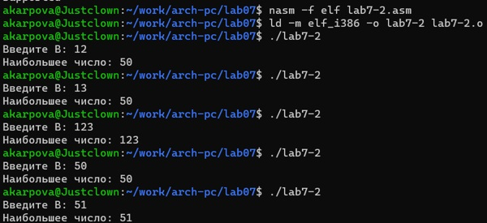{#fig:008 width=70%}

7.2. Изучение структуры файлы листинга

Обычно nasm создаёт в результате ассемблирования только объектный файл. Получить
файл листинга можно, указав ключ -l и задав имя файла листинга в командной строке.
Создаю файл листинга для программы из файла lab7-2.asm

{#fig:009 width=70%}

Откройте файл листинга lab7-2.lst с помощью любого текстового редактора

{#fig:009 width=70%}

Внимательно ознакамливаюсь с его форматом и содержимым. В представленных трёх строках содержатся след. данные:

"2" - номер строки кода"; Функция вычисления длинны сообщения" - комментарий к коду, не имеет адреса и машинного кода.
"3" - номер строки кода, "slen" - название функции, не имеет адреса и машинного кода.
"4" - номер строки кода, "00000000" - адрес строки, "53" - машинный код, "push ebx" - исходный текст программы, инструкция "push" помещает операнд "ebx" в стек. (рис. @fig:010)

{#fig:010 width=70%}

Открываю файл с программой lab7-2.asm и в выбранной мной инструкции с двумя операндами удаляю выделенный операнд. (рис. @fig:011).

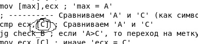{#fig:011 width=70%}

Выполняю трансляцию с получением файла листинга. На выходе я не получаю ни одного файла из-за ошибки:инструкция mov (единственная в коде содержит два операнда) не может работать, имея только один операнд, из-за чего нарушается работа кода. (рис. @fig:012)

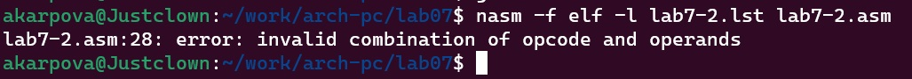{#fig:012 width=70%}

7.3. Выполнение задании для самостоятельной работы

Пишу программу нахождения наименьшей из 3 целочисленных переменных a, b и c. Значения переменных выбираю из табл. 7.5 в соответствии с вариантом, полученным при выполнении лабораторной работы № 6. Мой вариант под номером 15, поэтому мои значения - 32,6,54. (рис. @fig:013)

{#fig:013 width=70%}

Код программы:

%include 'in_out.asm'

section .data

msg db "Наименьшее число: ",0h

A dd '41'

B dd '62'

C dd '35'

section .bss

min resb 10

section .text

global _start

_start:

; ---------- Записываем 'A' в переменную 'min'

mov ecx,[A] ; 'ecx = A'

mov [min],ecx ; 'min = A'

; ---------- Сравниваем 'A' и 'С' (как символы)

cmp ecx,[C] ; Сравниваем 'A' и 'С'

jg check_B

mov ecx,[B] ; 
mov [min],ecx ; 'min = C'

; ---------- Преобразование 'min(A,C)' из символа в число

check_B:

mov eax,min

call atoi ; Вызов подпрограммы перевода символа в число

mov [min],eax ; запись преобразованного числа в min

; ---------- Сравниваем 'min(A,C)' и 'B' (как числа)

mov ecx,[min]

cmp ecx,[B] ; Сравниваем 'min(A,C)' и 'B'

jl fin ; если 'min(A,C)<B', то переход на 'fin',

mov ecx,[B] ; иначе 'ecx = B'

mov [min],ecx

; ---------- Вывод результата

fin:

mov eax, msg

call sprint ; Вывод сообщения 'Наименьшее число: '

mov eax,[min]

call iprintLF ; Вывод 'min(A,B,C)'

call quit ; Выход

2. Пишу программу, которая для введенных с клавиатуры значений х и а вычисляет значение и выводит результат вычислений заданной для моего варианта функции f(x):

a + 10, x < a
x + 10, x ≥ a 

%include 'in_out.asm'
section .data
msg1 db "Введите x:",0h
msg2 db "Введите a:",0h
msg3 db "Ответ:",0h
section .bss
x resb 10
a resb 10
section .text 
global _start
_start:
mov eax,msg1
call sprint
mov ecx,x
mov edx,10
call sread
mov eax,x
call atoi ; Вызов подпрограммы перевода символа в число
mov [x],eax ; запись преобразованного числа в 'x'

mov eax,msg2
call sprint
mov ecx,a
mov edx,10
call sread
; ---------- Преобразование 'a' из символа в число
mov eax,a
call atoi ; Вызов подпрограммы перевода символа в число
mov [a],eax ; запись преобразованного числа в 'a'

mov eax,[x]
mov ebx,[a]
cmp eax,ebx
jl fin
jmp fin1
fin:
mov eax, msg3
call sprint 
mov eax,[a]
add eax, 10
call iprintLF 
call quit ; Выход
fin1:
mov eax,msg3
call sprint
mov eax,[x]
add eax, 10
call iprintLF 
call quit ; Выход

Запускаю файл (рис. @fig:014)

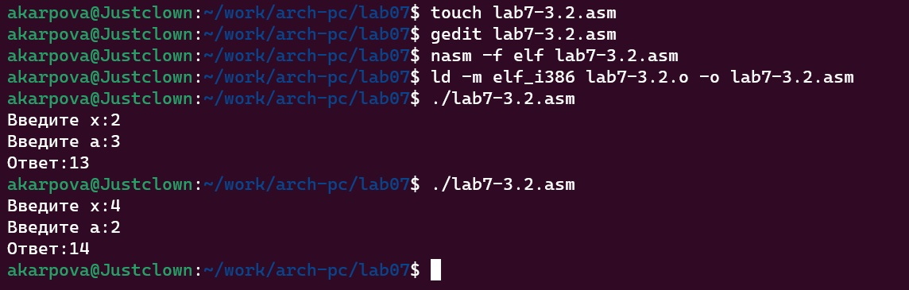{#fig:014 width=70%}

# Выводы

В ходе данной лабораторной работы я изучила команды условного и безусловного переходов, приобрела навыки написания программ с использованием переходов и ознакомилась с назначением и структурой файла листинга, что поможет мне при выполнении последующих лабораторных работ.

# Список литературы{.unnumbered}

