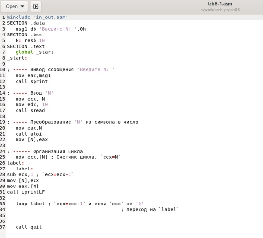
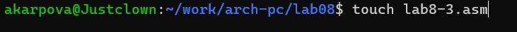

---
## Front matter
title: "Отчёт по лабораторной работе №8"
subtitle: "Дисциплина: Архитектура компьютеров"
author: "Карпова Анастасия Александровна"

## Generic otions
lang: ru-RU
toc-title: "Содержание"

## Bibliography
bibliography: bib/cite.bib
csl: pandoc/csl/gost-r-7-0-5-2008-numeric.csl

## Pdf output format
toc: true # Table of contents
toc-depth: 2
lof: true # List of figures
fontsize: 12pt
linestretch: 1.5
papersize: a4
documentclass: scrreprt
## I18n polyglossia
polyglossia-lang:
  name: russian
  options:
	- spelling=modern
	- babelshorthands=true
polyglossia-otherlangs:
  name: english
## I18n babel
babel-lang: russian
babel-otherlangs: english
## Fonts
mainfont: PT Serif
romanfont: PT Serif
sansfont: PT Sans
monofont: PT Mono
mainfontoptions: Ligatures=TeX
romanfontoptions: Ligatures=TeX
sansfontoptions: Ligatures=TeX,Scale=MatchLowercase
monofontoptions: Scale=MatchLowercase,Scale=0.9
## Biblatex
biblatex: true
biblio-style: "gost-numeric"
biblatexoptions:
  - parentracker=true
  - backend=biber
  - hyperref=auto
  - language=auto
  - autolang=other*
  - citestyle=gost-numeric
## Pandoc-crossref LaTeX customization
figureTitle: "Рис."
tableTitle: "Таблица"
listingTitle: "Листинг"
lofTitle: "Список иллюстраций"
lolTitle: "Листинги"
## Misc options
indent: true
header-includes:
  - \usepackage{indentfirst}
  - \usepackage{float} # keep figures where there are in the text
  - \floatplacement{figure}{H} # keep figures where there are in the text
---

# Цель работы

Приобретение навыков написания программ с использованием циклов и обработкой
аргументов командной строки.

# Задание

1. Реализация циклов в NASM
2. Обработка аргументов командной строки
3. Выполнение заданий для самостоятельной работы

# Теоретическое введение

Стек — это структура данных, организованная по принципу LIFO («Last In — First Out»
или «последним пришёл — первым ушёл»). Стек является частью архитектуры процессора и
реализован на аппаратном уровне. Для работы со стеком в процессоре есть специальные
регистры (ss, bp, sp) и команды.
Основной функцией стека является функция сохранения адресов возврата и передачи
аргументов при вызове процедур. Кроме того, в нём выделяется память для локальных
переменных и могут временно храниться значения регистров.
Стек имеет вершину, адрес последнего добавленного элемента, который хранится в регистре esp (указатель стека). Противоположный конец стека называется дном. Значение,
помещённое в стек последним, извлекается первым. При помещении значения в стек указатель стека уменьшается, а при извлечении — увеличивается.
Для стека существует две основные операции:
• добавление элемента в вершину стека (push);
• извлечение элемента из вершины стека (pop).
Команда push размещает значение в стеке, т.е. помещает значение в ячейку памяти, на
которую указывает регистр esp, после этого значение регистра esp увеличивается на 4.
Данная команда имеет один операнд — значение, которое необходимо поместить в стек.
Существует ещё две команды для добавления значений в стек. Это команда pusha, которая
помещает в стек содержимое всех регистров общего назначения в следующем порядке: ах,
сх, dx, bх, sp, bp, si, di. А также команда pushf, которая служит для перемещения в стек
содержимого регистра флагов. Обе эти команды не имеют операндов.
Команда pop извлекает значение из стека, т.е. извлекает значение из ячейки памяти, на
которую указывает регистр esp, после этого уменьшает значение регистра esp на 4. У этой
команды также один операнд, который может быть регистром или переменной в памяти.
Нужно помнить, что извлечённый из стека элемент не стирается из памяти и остаётся как
“мусор”, который будет перезаписан при записи нового значения в стек.
Аналогично команде записи в стек существует команда popa, которая восстанавливает
из стека все регистры общего назначения, и команда popf для перемещения значений из
вершины стека в регистр флагов.
Для организации циклов существуют специальные инструкции. Для всех инструкций
максимальное количество проходов задаётся в регистре ecx. Наиболее простой является инструкция loop. Она позволяет организовать безусловный цикл.

# Выполнение лабораторной работы

8.3.1. Реализация циклов в NASM

Создаю каталог для программам лабораторной работы № 8, перехожу в него и создаю файл lab8-1.asm (рис. @fig:001).

{#fig:001 width=70%}

Ввожу в файл lab8-1.asm текст программы из листинга 8.1. (рис. @fig:002)

{#fig:002 width=70%}

Создаю исполняемый файл и проверяю его работу. (рис. @fig:003)

{#fig:003 width=70%}

Создайте файл lab8-2.asm в каталоге ~/work/arch-pc/lab08

Программа выводит числа от N до 1 включительно
Изменяю текст программы добавив изменение значение регистра ecx в цикле. (рис. @fig:004)

{#fig:004 width=70%}

Создаю исполняемый файл и проверяю его работу (рис. @fig:005)

{#fig:005 width=70%}

В данном случае число проходов не соответствует введенному с клавиатуры значению. 
Снова изменяю текст программы, добавив команды push и pop для сохранения значения счётчика цикла loop (рис. @fig:006)

{#fig:006 width=70%}

Создаю исполняемый файл и проверяю его работу (рис. @fig:007)

{#fig:007 width=70%}

Теперь число проходов цикла соответствует введеному с клавиатуры значению и выводит числа от N-1 до 0 включительно 

8.3.2. Обработка аргументов командной строки

Создаю файл lab8-2.asm в каталоге lab08 (рис. @fig:008)

{#fig:008 width=70%}

Ввожу в него текст программы из листинга 8.2. (рис. @fig:009)

{#fig:009 width=70%}

Создаю исполняемый файл и запускаю его. (рис. @fig:010)

{#fig:010 width=70%}

Программа выводит 4 аргумента, так как аргумент 2 не взят в кавычки, в отличие от аргумента 3, поэтому из-за пробела программа не считывает 2 как отдельные аргумент.
Рассмотрим пример программы, которая выводит сумму чисел, которые передаются в программу как аргументы. Создаю файл lab8-3.asm в каталоге lab08. (рис. @fig:011)

{#fig:011 width=70%}

Ввожу в него текст программы из листинга 8.3. (рис. @fig:012)

{#fig:012 width=70%}

Создаю исполняемый файл и запускаю его, указав аргументы (рис. @fig:013)

{#fig:013 width=70%}

Изменяю текст программы для вычисления произведения аргументов командной строки (рис. @fig:014)

{#fig:014 width=70%}

Создаю исполняемый файл и запускаю его, указав аргументы (рис. @fig:015)

{#fig:015 width=70%}

8.4. Задание для самостоятельной работы

Пишу текст программы, которая находит сумму значений функции f(x) = 6x+13 в соответствие с моим вариантом - 15, для x1, x2, ..., xn. Значения xi передаются как аргументы. (рис. @fig:016)

{#fig:016 width=70%}

Создаю исполняемый файл и запускаю его, указав аргументы (рис. @fig:017)

{#fig:017 width=70%}

# Выводы
 
В ходе лабораторной работы я приобрела навыки написания программ с использованием циклов и обработкой аргументов командной строки.

# Список литературы{.unnumbered}

Архитектура ЭВМ

