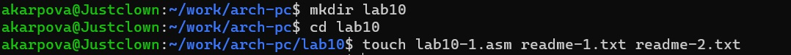
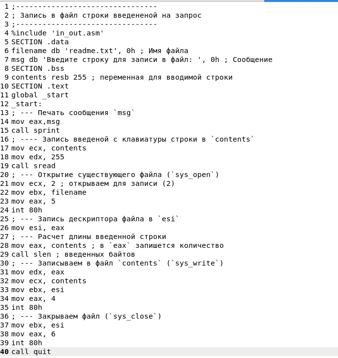
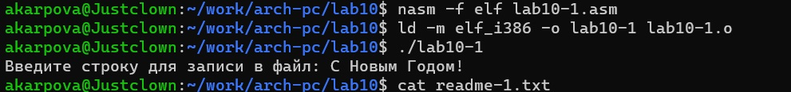
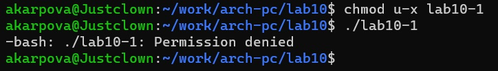
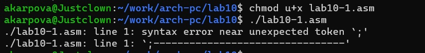
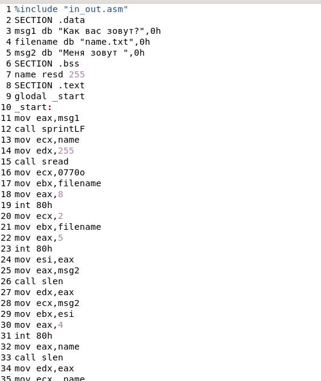

---
## Front matter
title: "Отчёт по лабораторной работе №10"
subtitle: "Дисциплина: Архитектура компьютера"
author: "Карпова Анастасия Александровна"

## Generic otions
lang: ru-RU
toc-title: "Содержание"

## Bibliography
bibliography: bib/cite.bib
csl: pandoc/csl/gost-r-7-0-5-2008-numeric.csl

## Pdf output format
toc: true # Table of contents
toc-depth: 2
lof: true # List of figures
fontsize: 12pt
linestretch: 1.5
papersize: a4
documentclass: scrreprt
## I18n polyglossia
polyglossia-lang:
  name: russian
  options:
	- spelling=modern
	- babelshorthands=true
polyglossia-otherlangs:
  name: english
## I18n babel
babel-lang: russian
babel-otherlangs: english
## Fonts
mainfont: PT Serif
romanfont: PT Serif
sansfont: PT Sans
monofont: PT Mono
mainfontoptions: Ligatures=TeX
romanfontoptions: Ligatures=TeX
sansfontoptions: Ligatures=TeX,Scale=MatchLowercase
monofontoptions: Scale=MatchLowercase,Scale=0.9
## Biblatex
biblatex: true
biblio-style: "gost-numeric"
biblatexoptions:
  - parentracker=true
  - backend=biber
  - hyperref=auto
  - language=auto
  - autolang=other*
  - citestyle=gost-numeric
## Pandoc-crossref LaTeX customization
figureTitle: "Рис."
tableTitle: "Таблица"
listingTitle: "Листинг"
lofTitle: "Список иллюстраций"
lolTitle: "Листинги"
## Misc options
indent: true
header-includes:
  - \usepackage{indentfirst}
  - \usepackage{float} # keep figures where there are in the text
  - \floatplacement{figure}{H} # keep figures where there are in the text
---

# Цель работы

Приобретение навыков написания программ для работы с файлами.

# Задание

1. Написание программы для работы с файлами
2. Выполнение заданий для лабораторной работы

# Теоретическое введение

ОС GNU/Linux является многопользовательской операционной системой. И для обеспечения защиты данных одного пользователя от действий других пользователей существуют
специальные механизмы разграничения доступа к файлам. Кроме ограничения доступа, данный механизм позволяет разрешить другим пользователям доступ данным для совместной
работы.
Права доступа определяют набор действий (чтение, запись, выполнение), разрешённых
для выполнения пользователям системы над файлами. Для каждого файла пользователь
может входить в одну из трех групп: владелец, член группы владельца, все остальные. Для
каждой из этих групп может быть установлен свой набор прав доступа. Владельцем файла
является его создатель. Для предоставления прав доступа другому пользователю или другой
группе командой
Свойства (атрибуты) файлов и каталогов можно вывести на терминал с помощью команды
ls с ключом -l.
Тип файла определяется первой позицией, это может быть: каталог — d, обычный файл
— дефис (-) или символьная ссылка на другой файл — l. Следующие 3 набора по 3 символа
определяют конкретные права для конкретных групп: r — разрешено чтение файла, w —
разрешена запись в файл; x — разрешено исполнение файл и дефис (-) — право не дано.
Для изменения прав доступа служит команда chmod, которая понимает как символьное,
так и числовое указание прав. Для того чтобы назначить файлу /home/debugger/README
права rw-r, то есть разрешить владельцу чтение и запись, группе только чтение, остальным
пользователям — ничего.
В символьном представлении есть возможность явно указывать какой группе какие права
необходимо добавить, отнять или присвоить.
В операционной системе Linux существуют различные методы управления файлами, например, такие как создание и открытие файла, только для чтения или для чтения и записи,
добавления в существующий файл, закрытия и удаления файла, предоставление прав доступа.
Обработка файлов в операционной системе Linux осуществляется за счет использования
определенных системных вызовов. Для корректной работы и доступа к файлу при его открытии или создании, файлу присваивается уникальный номер (16-битное целое число) –
дескриптор файла.
Для создания и открытия файла служит системный вызов sys_creat, который использует
следующие аргументы: права доступа к файлу в регистре ECX, имя файла в EBX и номер
системного вызова sys_creat (8) в EAX.
Для открытия существующего файла служит системный вызов sys_open, который использует следующие аргументы: права доступа к файлу в регистре EDX, режим доступа к файлу в
регистр ECX, имя файла в EBX и номер системного вызова sys_open (5) в EAX.
Системный вызов возвращает файловый дескриптор открытого файла в регистр EAX. В
случае ошибки, код ошибки также будет находиться в регистре EAX
Для записи в файл служит системный вызов sys_write, который использует следующие
аргументы: количество байтов для записи в регистре EDX, строку содержимого для записи
ECX, файловый дескриптор в EBX и номер системного вызова sys_write (4) в EAX.
Системный вызов возвращает фактическое количество записанных байтов в регистр EAX.
В случае ошибки, код ошибки также будет находиться в регистре EAX.
Прежде чем записывать в файл, его необходимо создать или открыть, что позволит получить дескриптор файла.
Для чтения данных из файла служит системный вызов sys_read, который использует
следующие аргументы: количество байтов для чтения в регистре EDX, адрес в памяти для
записи прочитанных данных в ECX, файловый дескриптор в EBX и номер системного вызова
sys_read (3) в EAX. Как и для записи, прежде чем читать из файла, его необходимо открыть,
что позволит получить дескриптор файла.
Для правильного закрытия файла служит системный вызов sys_close, который использует
один аргумент – дескриптор файла в регистре EBX. После вызова ядра происходит удаление
дескриптора файла, а в случае ошибки, системный вызов возвращает код ошибки в регистр
EAX.
Для изменения содержимого файла служит системный вызов sys_lseek, который использует следующие аргументы: исходная позиция для смещения EDX, значение смещения в
байтах в ECX, файловый дескриптор в EBX и номер системного вызова sys_lseek (19) в EAX.
Удаление файла осуществляется системным вызовом sys_unlink, который использует
один аргумент – имя файла в регистре EBX.

# Выполнение лабораторной работы

Создаю каталог для программам лабораторной работы № 10, перехожу в него и
создаю файлы lab10-1.asm, readme-1.txt и readme-2.txt (рис. @fig:001).

{#fig:001 width=70%}

Ввожу в файл lab10-1.asm текст программы из листинга 10.1 (рис. @fig:002)

{#fig:002 width=70%}

Создаю и запускаю исполняемый и проверяю егор работу (рис. @fig:003)

{#fig:003 width=70%}

Теперь с помощью команды chmod u-x изменяю права доступа к исполняемому файлу lab10-1, запретив его выполнение и теперь пытаюсь выполнить файл (рис. @fig:004)

{#fig:004 width=70%}

Файл не выполняется, так как в команде я указала u (себя) и "-" - отменить набор прав, а x - это право на исполнение

Далее, с помощью команды chmod+x я изменяю права доступа к файлу с исходным текстом программы, добавив права на исполнение, и снова выполняю файл (рис. @fig:005)

{#fig:005 width=70%}

Текстовый файл начинает исполнение, но не исполняется, тк содержит в себе команду терминала.
Мой вариант - 15. В соответствии с ним предоставляю права доступа к файлу readme-1.txt представленные в символьном виде, а для файла readme-2.txt в двоичном коде:
-wx --x rwx 
010 101 010 (рис. @fig:006)

{#fig:006 width=70%}

Выполнение заданий для самостоятельной работы

Пишу программу, выводящую приглашение "Как вас зовут?", которая считывает с клавиатуры фамилию и имя, создает файл в который записывается сообщение "Меня зовут ФИ" (рис. @fig:007)

{#fig:007 width=70%}

Создаю исполняемый и запускаю его. Проверяю наличие файло при помощи ls и сat. (рис. @fig:008)

![Создание и запуск исполняемого файла + проверка]](image/8.jpg){#fig:008 width=70%}

Код программы:

%include "in_out.asm"
SECTION .data
msg1 db "Как вас зовут?",0h
filename db "name.txt",0h
msg2 db "Меня зовут ",0h
SECTION .bss
name resd 255
SECTION .text
global _start
_start:
mov eax,msg1
call sprintLF
mov ecx,name
mov edx, 255
call sread
mov ecx, 0770o
mov ebx,filename
mov eax, 8
int 80h
mov ecx, 2
mov ebx,filename
mov eax, 5
int 80h
mov esi,eax
mov eax,msg2
call slen
mov edx,eax
mov ecx,msg2
mov ebx,esi
mov eax,4
int 80h
mov eax,name
call slen
mov edx,eax
mov ecx, name
mov ebx,esi
mov eax,4
int 80h
mov ebx,esi
mov eax,6
int 80h
call quit

# Выводы

В ходе лабораторной работы я приобрела навыки написания программ для работы с файлами

# Список литературы{.unnumbered}

1. Архитектура ЭВМ

